<div align="center">


<br />

<a href="https://git.io/typing-svg">
  
</a>

<br /><br />

<a href="https://github.com/hauchdev?tab=followers">
  
</a>

<a href="https://github.com/hauchdev?tab=repositories">
  
</a>

</div>

<br />

## `> whoami`

```yaml
handle: Hauchdev
role: Software Developer
location: Spain 🇪🇸

main_quest: Building software, tools and developer experiences

specialties:
  - Software & backend development
  - Minecraft server & plugin development
  - Open source projects
  - Developer tooling and automation
  - Performance & system optimization

currently:
  - Building new projects
  - Exploring better architectures
  - Contributing to open source

philosophy: "Performance is a feature."
current_status: "Probably refactoring something that already worked..."
```

I build software with a focus on **performance**, **reliability**, and **maintainability**. I enjoy turning ideas into real, production-ready projects—from Minecraft tooling and backend systems to developer-focused applications and open-source software.

I like automating repetitive work, keeping projects maintainable, and using **GitHub Actions** to continuously build, test, release, and update the things I work on. If something can be automated, I'll probably end up automating it.

<br />

## `> featured_projects`

<div align="center">

<table>
<tr>

<td width="33%" align="center" valign="top">

<br />

<a href="https://github.com/hauchdev/hChat">
  
</a>

<br />

<h3>hChat</h3>

<p>
  A lightweight and configurable Minecraft chat plugin focused on clean communication, customization, and a simple developer experience.
</p>

<br />


<br /><br />

<a href="https://github.com/hauchdev/hChat">
  
</a>

<br /><br />

</td>

<td width="33%" align="center" valign="top">

<br />

<a href="https://github.com/hauchdev">
  
</a>

<br />

<h3>Restartly</h3>

<p>
  An automated server restart and playtime management system designed to make Minecraft server administration simpler and more reliable.
</p>

<br />


<br /><br />

<a href="https://github.com/hauchdev">
  
</a>

<br /><br />

</td>

<td width="33%" align="center" valign="top">

<br />

<a href="https://hauch.dev">
  
</a>

<br />

<h3>Hauch.dev</h3>

<p>
  My personal developer platform and portfolio, built around modern web technologies, performance, and a configurable content architecture.
</p>

<br />


<br /><br />

<a href="https://hauch.dev">
  
</a>

<br /><br />

</td>

</tr>
</table>

</div>

<br />

## `> loadout`

<div align="center">


<br /><br />


<br /><br />


</div>

<br />

## `> automation`

I use **GitHub Actions** to keep my projects continuously updated instead of treating automation as an afterthought.

```yaml
automation:
  - automated builds and releases
  - dependency and version updates
  - continuous integration
  - artifact generation
  - scheduled maintenance
  - repository health checks
  - daily automated tasks

philosophy: "If it can be automated, it shouldn't be manual."
```

<br />

## `> system_metrics`

<div align="center">



<br />



<br />



<br />



<br />

<sub>Generated automatically from GitHub data.</sub>

</div>


<br />

## `> connection`

<div align="center">

**Have an idea worth building, an interesting technical problem, or a project you'd like to collaborate on?**

<br />

<a href="https://github.com/hauchdev">
  
</a>

<br /><br />

<sub>Build with purpose. Automate what you can. Optimize with evidence.</sub>

</div>

<br />


